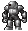
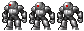
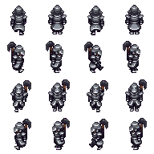

# React Pixel Motion

A lightweight React component for creating smooth, pixelated sprite animations. Perfect for games, retro-style interfaces, and pixel art animations. Totally inspired by [react-sprite-animation](https://github.com/jcblw/react-sprite-animator).

<div align="center">
  
</div>


## Features

- 🎮 Simple API for sprite sheet animations
- 🖼️ Support horizontal, vertical and grid sprite sheets
- 🔄 Control over animation speed, scale, and direction
- 📱 Responsive and lightweight

## Sprite Sheet example supports

<div align="center" style="display: flex; gap: 10px; justify-content: center; font-weight: bold;">
  <div style="display: flex; flex-direction: column; align-items: center;">
    <p>Sprite 1 row x 3 columns</p>
    
  </div>
  <div style="display: flex; flex-direction: column; align-items: center;">
    <p>Sprite 1 rows x 1 columns</p>
    
  </div>
  <div style="display: flex; flex-direction: column; align-items: center;">
    <p>Sprite 4 rows x 4 columns</p>
    
  </div>
</div>

## Installation

```bash
# Using npm
npm install @ga1az/react-pixel-motion

# Using yarn
yarn add @ga1az/react-pixel-motion

# Using pnpm
pnpm add @ga1az/react-pixel-motion

# Using bun
bun add @ga1az/react-pixel-motion
```

## Usage

```tsx
import PixelMotion from "@ga1az/react-pixel-motion";
import characterSprite from './assets/character.svg'; // or any other image format
import warrior from './assets/warrior.png';

function App() {
  return (
    <PixelMotion
      sprite={characterSprite}
      width={24} // Width of each frame in pixels
      height={31} // Height of each frame in pixels
      frameCount={3} // Total number of frames in the sprite sheet
      fps={10} // Frames per second for the animation
      scale={5} // Scale factor for the sprite
      startFrame={0} // Initial frame to start the animation
      loop={true} // Whether the animation should loop
      shouldAnimate={true} // Whether the animation should play
      direction="horizontal" // Direction of the sprite sheet
    />
    // Grid 4x4 example
    <PixelMotion
      sprite={warrior}
      width={30}
      height={30}
      scale={5}
      fps={5}
      shouldAnimate={true}
      direction="grid"
      gridOptions={{
        columns: 4, // Total columns in the sprite sheet
        rows: 4, // Total rows in the sprite sheet
        rowIndex: 0, // Index of the row to animate
      }}
    />
  );
}
```

## API

### Props

| Prop | Type | Default | Description |
|------|------|---------|-------------|
| `sprite` | `string` | *Required* | URL or import of the sprite sheet image |
| `width` | `number` | *Required* | Width of each frame in pixels |
| `height` | `number` | *Required* | Height of each frame in pixels |
| `frameCount` | `number` | `1` | Total number of frames in the sprite sheet |
| `fps` | `number` | `60` | Frames per second for the animation |
| `direction` | `'horizontal'` \| `'vertical'` \| `'grid'` | `'horizontal'` | Direction of the sprite sheet |
| `shouldAnimate` | `boolean` | `false` | Whether the animation should play |
| `scale` | `number` | `1` | Scale factor for the sprite |
| `startFrame` | `number` | `0` | Initial frame to start the animation |
| `loop` | `boolean` | `false` | Whether the animation should loop |
| `gridOptions` | `{ columns: number, rows: number, rowIndex?: number, columnIndex?: number, gap?: number }` | `undefined` | Options for grid sprite sheets |

## Development

```bash
bun install
bun run dev # to run the demo
bun run build # to build the library
```

